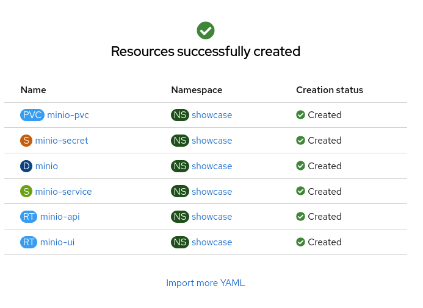

# Guide to Deploying AI Models on Red Hat OpenShift AI (RHOAI)

## Prerequisites 

A cluster that has been properly configured for model serving. If cluster is not yet properly configured follow the [Guide to Configuring RHOAI for Model Deployment](https://github.com/IsaiahStapleton/rhoai-config-guide)

## Purpose

The purpose for this guide is to offer the simplest steps for deploying an AI model on RHOAI. This guide will specifically be covering deploying the ***Granite Model*** using the ***vLLM ServingRuntime for KServe*** using a ***NVIDIA A100 GPU***. In addition to deploying the model, this guide will cover setting up a simple observability stack so that you can collect and visualize metrics related to AI model performance and GPU information.

## 1. Deploying S3 Storage using Minio 

### 1.1. What is Minio?

[Minio](https://min.io/) is a high-performance, S3 compatible **object store**. It can be deployed on a wide variety of platforms, and it comes in multiple [flavors](https://min.io/pricing).

### 1.2. Deploying Minio in Project Namespace

1. Within your namespace in the OpenShift console, click on the + ("Import YAML") button:


2. Paste the following YAML in the box, but don't press ok yet!:

```
---
kind: PersistentVolumeClaim
apiVersion: v1
metadata:
  name: minio-pvc
spec:
  accessModes:
    - ReadWriteOnce
  resources:
    requests:
      storage: 50Gi
  volumeMode: Filesystem
---
kind: Secret
apiVersion: v1
metadata:
  name: minio-secret
stringData:
  # change the username and password to your own values.
  # ensure that the user is at least 3 characters long and the password at least 8
  minio_root_user: minio
  minio_root_password: minio123
---
kind: Deployment
apiVersion: apps/v1
metadata:
  name: minio
spec:
  replicas: 1
  selector:
    matchLabels:
      app: minio
  template:
    metadata:
      creationTimestamp: null
      labels:
        app: minio
    spec:
      volumes:
        - name: data
          persistentVolumeClaim:
            claimName: minio-pvc
      containers:
        - resources:
            limits:
              cpu: 250m
              memory: 1Gi
            requests:
              cpu: 20m
              memory: 100Mi
          readinessProbe:
            tcpSocket:
              port: 9000
            initialDelaySeconds: 5
            timeoutSeconds: 1
            periodSeconds: 5
            successThreshold: 1
            failureThreshold: 3
          terminationMessagePath: /dev/termination-log
          name: minio
          livenessProbe:
            tcpSocket:
              port: 9000
            initialDelaySeconds: 30
            timeoutSeconds: 1
            periodSeconds: 5
            successThreshold: 1
            failureThreshold: 3
          env:
            - name: MINIO_ROOT_USER
              valueFrom:
                secretKeyRef:
                  name: minio-secret
                  key: minio_root_user
            - name: MINIO_ROOT_PASSWORD
              valueFrom:
                secretKeyRef:
                  name: minio-secret
                  key: minio_root_password
          ports:
            - containerPort: 9000
              protocol: TCP
            - containerPort: 9090
              protocol: TCP
          imagePullPolicy: IfNotPresent
          volumeMounts:
            - name: data
              mountPath: /data
              subPath: minio
          terminationMessagePolicy: File
          image: >-
            quay.io/minio/minio:latest
          args:
            - server
            - /data
            - --console-address
            - :9090
      restartPolicy: Always
      terminationGracePeriodSeconds: 30
      dnsPolicy: ClusterFirst
      securityContext: {}
      schedulerName: default-scheduler
  strategy:
    type: Recreate
  revisionHistoryLimit: 10
  progressDeadlineSeconds: 600
---
kind: Service
apiVersion: v1
metadata:
  name: minio-service
spec:
  ipFamilies:
    - IPv4
  ports:
    - name: api
      protocol: TCP
      port: 9000
      targetPort: 9000
    - name: ui
      protocol: TCP
      port: 9090
      targetPort: 9090
  internalTrafficPolicy: Cluster
  type: ClusterIP
  ipFamilyPolicy: SingleStack
  sessionAffinity: None
  selector:
    app: minio
---
kind: Route
apiVersion: route.openshift.io/v1
metadata:
  name: minio-api
spec:
  to:
    kind: Service
    name: minio-service
    weight: 100
  port:
    targetPort: api
  wildcardPolicy: None
  tls:
    termination: edge
    insecureEdgeTerminationPolicy: Redirect
---
kind: Route
apiVersion: route.openshift.io/v1
metadata:
  name: minio-ui
spec:
  to:
    kind: Service
    name: minio-service
    weight: 100
  port:
    targetPort: ui
  wildcardPolicy: None
  tls:
    termination: edge
    insecureEdgeTerminationPolicy: Redirect
```
3. By default, the size of the storage is 50 GB. (see line 11). Change it if you need to, however it is not necessary to change it for this guide.

4. If you want to, edit lines 21-22 to change the default user/password.

5. Press Create.

6. You should see:



7. And there should now be a running minio pod:


8. As well as two minio routes:
- The -api route is for programmatic access to Minio
- The -ui route is for browser-based access to Minio


## 2. Downloading Model 

Navigate to https://huggingface.co/ and find the model you would like to deploy. For this guide I am going to be downloading the granite-3.0-8b-instruct model (https://huggingface.co/ibm-granite/granite-3.0-8b-instruct/tree/main).

First you need to generate an access token:
1. Navigate to settings -> access tokens
2. Select create new token
3. For token type, select Read and then give it a name
4. Copy the token

Now that you have a token, you can download the model.

`git clone https://<user_name>:<token>@huggingface.co/<repo_path>`

For me this looks like

`git clone https://IsaiahS1:<token>@huggingface.co/ibm-granite/granite-3.0-8b-instruct`


## 3. Uploading the Model to the S3 Minio Storage

1. Assuming you followed the steps above to deploy minio storage, navigate to the minio UI, found in Networking -> routes within the openshift console.


2. Login with the credentials you specified in the minio deployment

3. Create a bucket, give it a name such as “Models”, select create bucket


4. Select your bucket from the object browser 


5. From within the bucket, select upload -> upload folder, and select the folder where the model was downloaded from huggingface. Wait for the upload to finish, this will take a while.


## 4. Deploying Model on Red Hat OpenShift AI

### 4.1. Create S3 Storage Data Connection

1. Within your data science project, navigate to connections and select create connection


2. Fill in the following values:
- Connection name: name of your data connection
- Access key: username of minio deployment
- Secret key: password for minio deployment
- Endpoint: endpoint of the minio deployment 
- Bucket: name of the minio bucket you created


### 4.2. Deploy your Model!


## 5. Setting up Observability Stack & Collecting Metrics