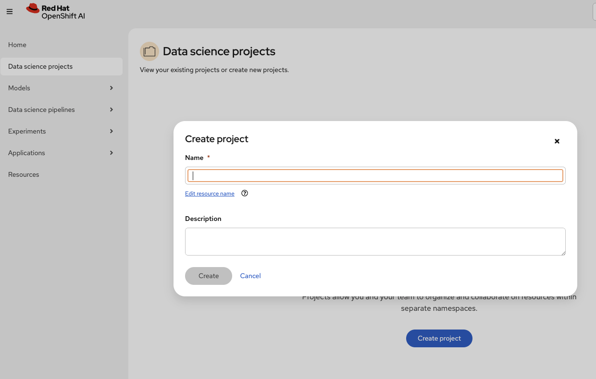
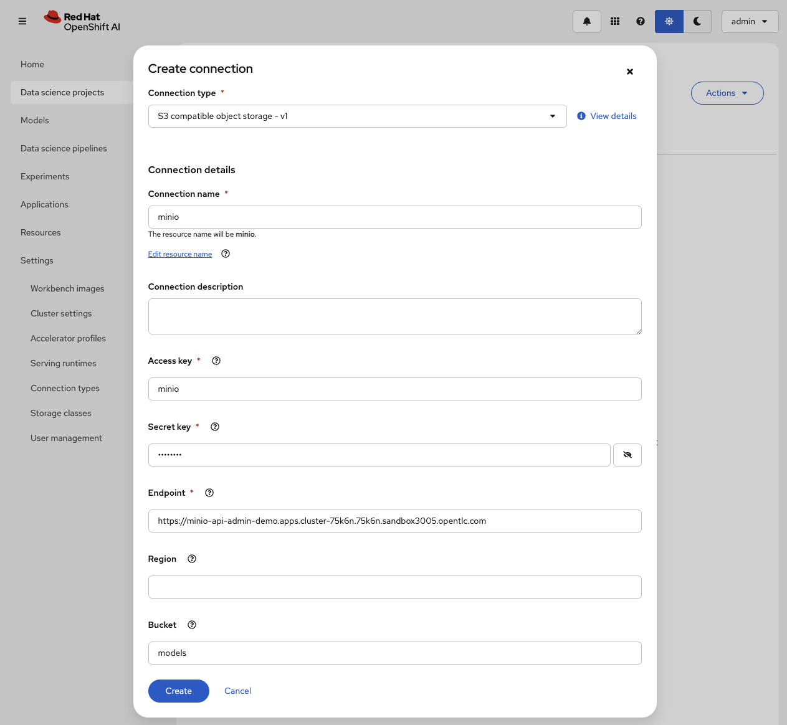
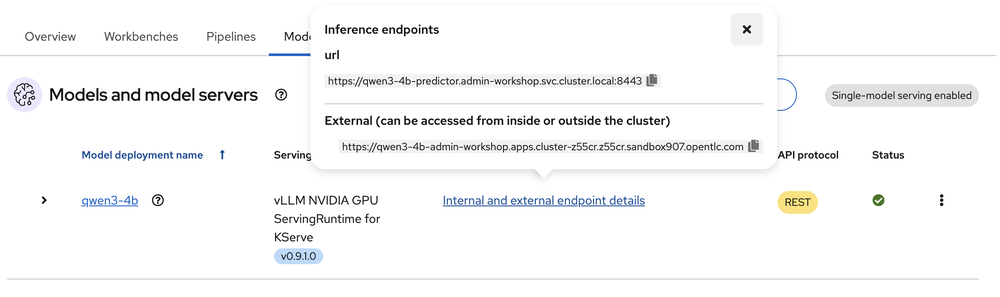
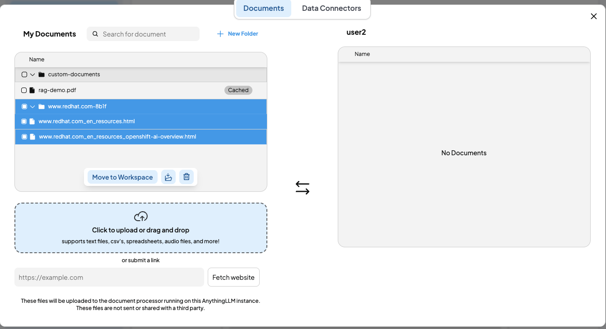

# Guide To Deploy AI Models on Red Hat OpenShift AI (RHOAI)

## Overview
1.  Walkthrough of the provisioned environment, Red Hat Openshift AI Dashboard

1. Create and connect to the Object Store

1. Deploy a generative AI model with serving endpoint

1. Create and use a custom workbench with the deployed inference server

1. QnA with Retrieval Augmented Generation

1. Monitor the deployed model

## Prerequisites 

A cluster that has been properly configured for model serving. If cluster is not yet properly configured follow the [Guide to Configuring RHOAI for Model Deployment](https://github.com/IsaiahStapleton/rhoai-config-guide)

## Purpose

The purpose for this guide is to offer the simplest steps for deploying a **privately hosted AI model** on Red Hat Openshift AI. This guide will be covering deploying a Red Hat certified ***Qwen3 Model*** using the ***vLLM ServingRuntime for KServe*** on ***NVIDIA GPU***. In addition to deploying the model, this guide will cover setting up a simple observability stack so that you can collect and visualize metrics related to AI model performance and GPU information.

## 1. Deploying S3 Storage using Minio 

### 1.1 What is Minio?

[Minio](https://min.io/) is a high-performance, S3 compatible **object store**. It can be deployed on a wide variety of platforms, and it comes in multiple [flavors](https://min.io/pricing).

### 1.2 Deploying Minio in Project Namespace

1. Apply the minio setup
- By default, the size of the storage is 50 GB. (see line 11). Change it if you need to, however it is not necessary to change it for this guide.
- If you want to, edit lines 21-22 to change the default user/password.

```
oc apply -f minio-setup.yaml
```


2. Give it a minute, and there should now be a running minio pod:


3. As well as two minio routes:
- The -api route is for programmatic access to Minio
- The -ui route is for browser-based access to Minio


## 2. Getting An Open Sourced Model 

Navigate to https://huggingface.co/ and find the model you would like to deploy. 

In this workshop, we will be using Red Hat certified models at https://huggingface.co/RedHatAI. We will use the ([Qwen3-4B-quantized.w4a16 model](https://huggingface.co/RedHatAI/Qwen3-4B-quantized.w4a16)).

First you need to generate an access token:
1. Navigate to settings -> access tokens
2. Select create new token
3. For token type, select Read and then give it a name
4. Copy the token

Now that you have a token, you can download the model.

```
git clone https://<user_name>:<token>@huggingface.co/<repo_path>
```

For me this looks like

```
git clone https://cbtham:<token>@huggingface.co/RedHatAI/Qwen3-4B-quantized.w4a16
```


## 3. Deploy a generative AI model with serving endpoint

### Option 1: Use a pre-built modelcar container
Option 1 explores the method of using a pre-built container as a serving endpoint. We will deploy this modelcar container. This is the easiest way to get a LLM model running on Red Hat OpenShift AI.

1. Navigate to https://quay.io/repository/redhat-ai-services/modelcar-catalog
1. Select a containerized model you want to use. In this example, we will use qwen3-4b. 
1. Click the download/save button to reveal the tags, select any of the tag to reveal the URI.

1. Copy the URL from quay.io onwards.
1. Next, deploy the model by navigating to the Models tab in your workspace on Red Hat Openshift AI.
1. Fill in the details, ensure to choose nvidia gpu serving runtime and deployment mode to Standard.

1. Select connection type *URI - v1* and give it a name. A good practice is to name it the model you are about to deploy.
1. Next, append the URI with oci://

1. Wait for the model to finish deploy and the status turns green. 
> Note: It may take up to a few minutes depending on model size.

### Option 2: Upload Model to the S3 Minio Storage

Option 2 explores a method to upload a model from HuggingFace to S3 Storage.
1. Assuming you followed the steps above to deploy minio storage, navigate to the minio UI, found in Networking -> routes within the openshift console.

    

2. Login with the credentials you specified in the minio deployment

3. Create a bucket, give it a name such as “Models”, select create bucket

    

    

4. Select your bucket from the object browser 

    

5. From within the bucket, select upload -> upload folder, and select the folder where the model was downloaded from huggingface. Wait for the upload to finish, this will take a while.

    


## 4. Deploying Model on Red Hat OpenShift AI

### 4.0.1 Create a workspace
Login to your openshift account. If you're in a workshop, click [here](https://rhods-dashboard-redhat-ods-applications.apps.cluster-75k6n.75k6n.sandbox3005.opentlc.com/). Go to Data Science Projects and create a project.

  

### 4.1 Create S3 Storage Data Connection on Red Hat Openshift AI

In the Red Hat OpenShift AI portal, we will need to create a linkage to the deployed S3 storage. You can also BYO Storage by connecting it with the S3 compatible storage you prefer.

1. In Red Hat OpenShift AI, within your data science project, navigate to connections and select create connection

    

2. Fill in the following values:
- Connection name: name of your data connection **MinIO**
- Access key: username of minio deployment **[minio]**
- Secret key: password for minio deployment **[minio123]**
- Endpoint: **API** endpoint of the minio deployment **[https://minio-api-admin-demo.apps.cluster-75k6n.75k6n.sandbox3005.opentlc.com]**
- Bucket: name of the minio bucket you created **[models]**

  

### 4.2. Deploy your Model!

If you are in a workshop, navigate to the [Minio UI](https://minio-ui-admin-demo.apps.cluster-75k6n.75k6n.sandbox3005.opentlc.com/). You'll see a few pre-uploaded models. Pick one of it as part of the exercise.

Go to the Models tab within your Data Science Project and select single-model serving:

<!-- ***Note that once you select single or multi model serving, you are unable to change it without going into the openshift console and changing the value of the `modelmesh-enabled` tag on the namespace, true means multi model serving is enabled, false means single model serving is enabled. You can remove the tag entirely from the namespace if you want the option to select between the UI like you were able to in this step*** -->

  

After selecting single-models serving, select Deploy Model

  

2. Fill in the following values:
- ***Model deployment name***: Name of the deployed model
- ***Serving runtime***: vLLM NVIDIA GPU ServingRuntime for KServe
- ***Model server size***: You can select whatever size you wish, for this guide I will keep the small size 
- ***Accelerator***: Select NVIDIA GPU
- ***Model route***: Select check box for "Make deployed models available through an external route" this will enable us to send requests to the model endpoint from outside the cluster
- ***Token authentication***: Select check box for "Require token authentication" this makes it so that sending requests to the model endpoint requires a token, which is important for security. You can leave the service account name as default-name
- ***Source model location***: Select the data connection that you set up in step 4.1. Then provide it the path to your model. If you're following this guide, the path will be qwen3-4b-quantizedw4a16. If you're unsure of the path you can go to the minio-ui, navigate to the models bucket you created, and see the name of the directory where the model is stored.

  

  

Once that is done, you are all set to hit Deploy! It will take some time for the model to be deployed.

### 4.3 Query Model Inference Endpoint

Once your model pod is in a running state, you can try querying it in order to test if the endpoint is reachable and the model is returning correctly. The status will have a green tick.

1. Get the URL for the model endpoint, you can get this by selecting internal and external endpoint details from the RHOAI UI within the models tab in your Data Science Project:

    

2. Get the Authorization Token for your model by selecting the dropdown to the left of your model name. Your Authorization Token is at the bottom under "token authentication" -> "token secret", you can just copy the token directly from the UI

    

3. Now that you have the URL and Authorization Token, you can try querying the model endpoint. We will try multiple queries.

#### /v1/models
Let's start with the simplest query, the /v1/models endpoint. This endpoint just returns information about the models being served, we can use it to simply see if the model can accept a request and return with some information. Open up a command window or terminal of your chosing on your computer:

> Note: Remember to change the url and bearer token. the url must end with v1/models.

```shell
curl -k -X GET https://url/v1/models -H "Authorization: Bearer YOUR_BEARER_TOKEN"
```

Running this command should return an output similar to the below output

>{"object":"list","data":[{"id":"qwen3-4b-quantizedw4a16","object":"model","created":1743010793,"owned_by":"vllm","root":"/mnt/models","parent":null,"max_model_len":4096,"permission":[{"id":"modelperm-09f199065a2846ec8bbfabea78f72349","object":"model_permission","created":1743010793,"allow_create_engine":false,"allow_sampling":true,"allow_logprobs":true,"allow_search_indices":false,"allow_view":true,"allow_fine_tuning":false,"organization":"*","group":null,"is_blocking":false}]}]}

#### v1/completions

Now that we know that works, let's test whether the /v1/completions endpoint works. This endpoint takes a text prompt and returns a completed text response. 

```shell
curl -k -X POST https://url/v1/completions \
    -H "Content-Type: application/json" -H "Authorization: Bearer YOUR_BEARER_TOKEN" \
    -d '{
        "model": "MODEL_NAME",
        "prompt": "Red Hat is",
        "max_tokens": 7,
        "temperature": 0.7
    }'
```

Running this command should return an output similar to the following:

> {"id":"cmpl-40be2aa235c94f38a3b6161c6b93b59c","object":"text_completion","created":1743011184,"model":"qwen3-4b-quantizedw4a16","choices":[{"index":0,"text":" a company that provides software and services.","logprobs":null,"finish_reason":"length","stop_reason":null,"prompt_logprobs":null}],"usage":{"prompt_tokens":4,"total_tokens":11,"completion_tokens":7}}

You can see within "text" the completed response "Red Hat is a... a company that provides software and services."

You can change the ***temperature*** of the query. The temperature essentially controls the "randomness" of the model's response. The lower the temperature the more deterministic the response, the higher the temperature the more random/unpredictable the response. So if you set the temperature to 0, it would always return the same output since there would be no randomness. 

### 4.4 Wrapping Up

Congratulations! You have now successfully deployed a LLM model on Red Hat Openshift AI using the vLLM ServingRuntime for KServe.

## 5. Deploy A Custom Workbench To Interact With The LLM

### 5.1 AnythingLLM
AnythingLLM is a full-stack application that enables you to turn any document, resource, or piece of content into context that any LLM can use as a reference during chatting. This application allows you to pick and choose which LLM or Vector Database you want to use as well as supporting multi-user management and permissions.

#### 5.1.1 AnythingLLM in Red Hat Openshift AI
To get started quickly, we will use a custom workbench - a feature offered by Red Hat Openshift AI to quickly host compatible containerized applications easily.
  
  >*Step 1 may already have been setup by your admin. If you are participating in a workshop, skip this and continue on to **step 2**.*

  1. We will add an image by providing the details of the hosted container registry. Navigate to ```https://quay.io/rh-aiservices-bu/anythingllm-workbench:1.7.5``` Copy the URL and paste it into Settings > Workbench Images > image location.

      


  1. Create a new workbench, pick the name of the workbench you have given in the previous step. If you are participating in a workshop and your admin have already set up for you, choose "AnythingLLM".

      

      Remember to make your storage name unique to avoid name clash.
      
      

  1. Wait for the workbench to start. You should see a green status showing it is running. Click on the name to navigate to AnythingLLM UI.

      

### 5.2 Connecting AnythingLLM To Our Privately Hosted Model
AnythingLLM is able to consume inference endpoints from multiple AI provider. In this exercise, we will connect it to our privately hosted LLM inference endpoints set up in previous steps.

1. Select OpenAI Compatible API

    

1. Paste the baseURL from your deployed model(external endpoint) and append **/v1** on it. It will look like this example

    ```https://qwen3-4b-quantizedw4a16-cbtham-demo-llm.apps.cluster-q2cbm.q2cbm.sandbox1007.opentlc.com/v1```

1. Paste the token copied from above steps as the API key. The token starts with ey....

    

1. Use the name of the model you deployed. In this example, I use qwen3-4b-quantizedw4a16 as the name of the model. You may key in the name of your model that you want to use. You can refer the model name from the deployed model URL at Red Hat OpenShift AI models tab.

1. Set the context window and max token to 4096.

1. Once it is saved, navigate back to the main page of AnythingLLM and start a chat. If everything is set up properly, you will be greeted with a response from the LLM.

    

### 5.3 Retrieval Augmented Generation with AnythingLLM 
RAG, or Retrieval-Augmented Generation, is an AI framework that combines the strengths of traditional information retrieval systems with generative large language models (LLMs). It allows LLMs to access and reference information outside their training data to provide more accurate, up-to-date, and relevant responses. Essentially, RAG enhances LLMs by enabling them to tap into external knowledge sources, like documents, databases, or even the internet, before generating text.

For the purpose of demonstration, we will use a local vector database - LanceDB.

LanceDB is deployed as part of AnythingLLM. You may explore the settings page of AnythingLLM to provide your own vector database.

### 5.4 Scraping Website For RAG
You may insert your own pdf, csv or any digestible format for RAG. In this guide, we will step up a notch to scrape website and use its data as RAG. We will use built-in scraper from AnythingLLM, after getting the data, it will chunk it and store in the vector database LanceDB for retrieval.

1. We first ask a question and capture the default response. We'll see the LLM gave us a generic response.
   > Ask: What is an AI tool from Intel?
   
   
   We can see the response is short and very generic.

#### Option 1 : Upload your own data (PDF)
2. Now lets implement RAG by attaching a pdf. Click on the upload button beside your user workspace. Upload the pdf rag-demo.pdf in this repository.
    
3. After that, move it to the workspace and click Save and Embed.
    
4. We can see the answer after RAG is more detailed with reference to the data we uploaded.
    

#### Option 2 : Scrapping a website

5. Now let's try another way to implement RAG by scraping a website. The website has a section which has a better answer to our previous question.
6. Instead of uploading a document, select Data Connector and click bulk link scraper.
    
7. Input the link, set the depth to 1 and click Submit.
   > https://www.redhat.com/en/resources/openshift-ai-overview
8. Web scraping will take some time especially with the depth set to a higher value. If you are an admin, you can navigate to the anythingllm pod and see the process of scraping, chunking and embedding.
9. Once this step is done, you will see the data available. Move it to the workspace, save and embed.
    
10. After that, ask a question and you can see the answer is much more detailed and with reference to the scraped website.

11. Behind the scenes, AnythingLLM scraped the website, chunked it and embedded it into the workspace. This view is only available as admin.
    

## 6. Setting up Observability Stack & Collecting Metrics

The following section requires you run code in a Terminal. You can run this directly on Red Hat Openshift console or run this through your local terminal connected to the openshift cluster. When you are ready, git clone this repository.

```shell
git clone https://github.com/cbtham/rhoai-genai-workshop.git
```

### 6.1 Prometheus 

#### 6.1.1 Configuring Prometheus - [Enable monitoring for user-defined projects](https://docs.redhat.com/en/documentation/openshift_container_platform/4.8/html/monitoring/enabling-monitoring-for-user-defined-projects#enabling-monitoring-for-user-defined-projects_enabling-monitoring-for-user-defined-projects) 

Prometheus is installed by default with OpenShift. However, the default monitoring stack only collects metrics related to core OpenShift platform components. Therefore we need to enable User Workload Monitoring in order to collect metrics from the model we have deployed. 

In order to enable monitoring for user-defined projects, we need to set `enableUserWorkload: true` in the cluster monitoring ConfigMap object. You can do this by applying the following yaml:

```
oc apply -f obs/cluster-monitoring-config.yaml -n openshift-monitoring
```

#### 6.1.2 Add vLLM metrics to user-workload (uwl) metrics allowlist

Now that we have enabled user-workload monitoring, we just need to add vLLM to the list of metrics we want Prometheus to gather. We can do this by adding `vllm:.*` to the `metrics_allowlist.yaml` in the project namespace. Before applying the yaml, make sure to **CHANGE** the value of namespace to the namespace that your model has been deployed in. Once you've changed the namespace value, deploy with the following command.

```shell
oc apply -f obs/metrics_allowlist.yaml
```
> Note: If you face Error from server (NotFound): error when creating "obs/metrics_allowlist.yaml": namespaces "YOUR_PROJECT_NAMESPACE" not found, modify the metrics_allowlist.yaml to include reflect your project namespace.

### 6.2 Grafana

#### 6.2.1 [Install & Setup Grafana](https://grafana.com/docs/grafana/latest/setup-grafana/installation/kubernetes/)

1. Create Grafana namespace

```
oc create namespace grafana
```

2. Deploy grafana PVC, Service, and Deployment

```
oc apply -f obs/grafana-setup.yaml -n grafana
```

3. Apply route to expose Grafana UI externally

```
oc apply -f obs/expose-grafana.yaml -n grafana
```

4. Get the Grafana route URL:

```
oc get route grafana -n grafana -o jsonpath='https://{.spec.host}{"\n"}'
```


#### 6.2.2 Adding Data Source to Grafana

1. Create Grafana Secret Token

This is used so that Grafana can access the Prometheus Data Source.


```
oc apply -f obs/grafana-prometheus-token.yaml -n grafana --namespace=openshift-monitoring
```

Get the token by running the following command:

```
oc get secret grafana-prometheus-token \
  -n openshift-monitoring \
  -o jsonpath='{.data.token}' | base64 -d && echo
```

2. Add Data Source in Grafana UI

Navigate to data sources -> add data source


Select Prometheus as the data source, then fill in the following values:
- ***Prometheus Server URL***: https://thanos-querier.openshift-monitoring.svc.cluster.local:9091
- ***Skip TLS certificate Validation***: Check this box 
- ***HTTP headers***:
    - Header: Authorization
    - Value: Bearer [Token created in step 5.5]

  > Prometheus server url is the same for everyone
  
  > The Value should include "Bearer\<SPACE\>YOUR_TOKEN"

Once the above is filled out, hit save and test at the bottom. You should then see the following:


3. Verify vLLM and DCGM Metrics can be read from Data Source

We want to make sure Grafana is actually getting the vLLM and DCGM metrics from the Data Source.

Go to explore->metrics explorer and then for the metric value type vllm, verify that you can see the different vllm metrics. Then type DCGM, and verify you can see the different DCGM metrics.


### 6.3 Importing vLLM Dashboard

The vLLM dashboard that is used by Emerging Tech and Red Hat Research can be found here: https://github.com/redhat-et/ai-observability/blob/main/vllm-dashboards/vllm-grafana-openshift.json. This dashboard is based on the upstream vLLM dashboard. 

Go to Dashboards -> Create Dashboard


Select Import a dashboard. Then either upload the [vLLM dashboard yaml](https://github.com/redhat-et/ai-observability/blob/main/vllm-dashboards/vllm-grafana-openshift.json) or just copy and paste the yaml into the box provided.


Then hit load, then Import.


### 6.4 Importing DCGM Dashboard

The DCGM Grafana Dashboard can be found here: https://grafana.com/grafana/dashboards/12239-nvidia-dcgm-exporter-dashboard/. 

Go back to dashboards in Grafana UI and select new->import. Copy the following dashboard ID: `12239`. Paste that dashboard ID on Import Dashboard page. Then hit load.


Select prometheus data source then select Import.


Now you should have successfully imported the NVIDIA DCGM Exporter Dashboard, useful for GPU Monitoring.


## Knowledge Base
### Model pod automatically terminated (Workaround)

Post deploying your model, after some time the pod for the model may terminate. You have to manually go into the console and spin it back up to 1. After this, the model should not terminate again and the model pod should successfully be created. This is a current bug that is caused by large models being deployed. We believe the issue may be caused because the model is of a size that it takes a while to get it in place on the node or into the cluster that it isn't given a proper enough amount of breathing room to actually allow it to start up. This bug is currently in the backlog of things to fix. So for now with bigger models like granite, you will have to manually spin the pod back up.


After some minutes you can see my pod was terminated the deployment scaled to 0. I will just manually scale it back to 1 in the UI, or I can run the following command from the cli:

```
oc scale deployment/[deployment_name] --replicas=1 -n [namespace] --as system:admin
```

For me this looks like

```
oc scale deployment/demo-granite-predictor-00001-deployment --replicas=1 -n sandbox --as system:admin
```

After this it will take some time for the model pod to spin back up.