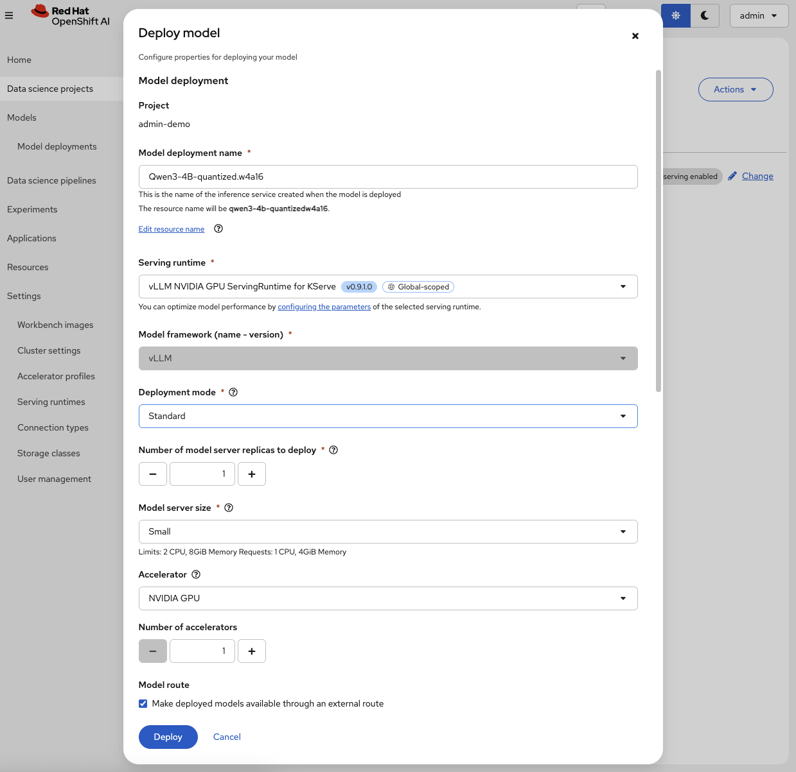
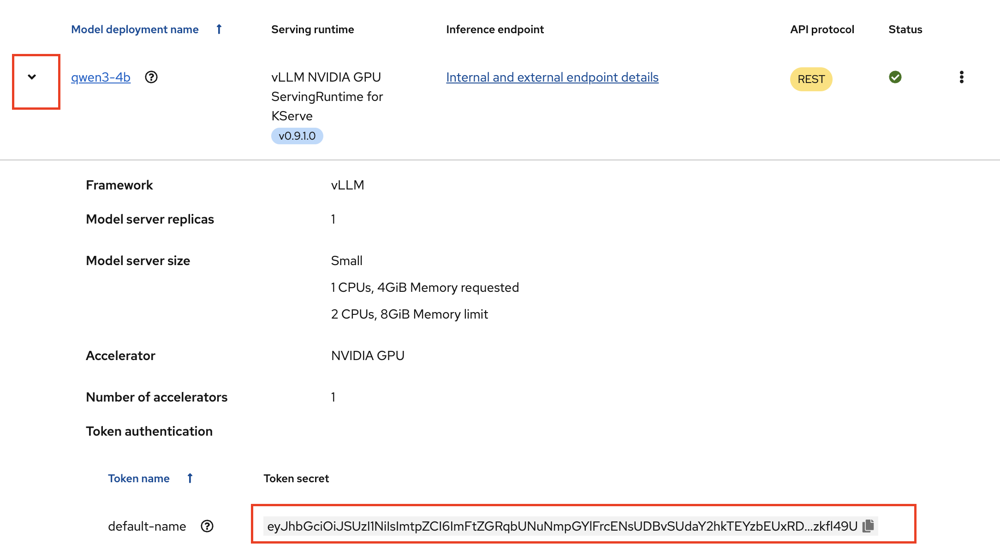
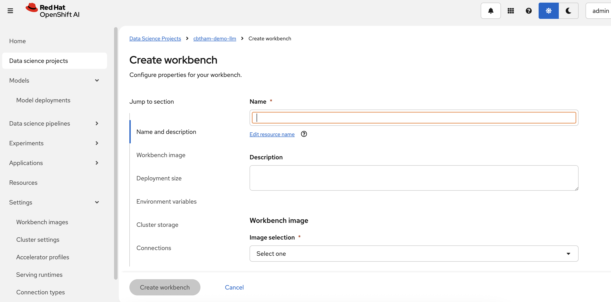
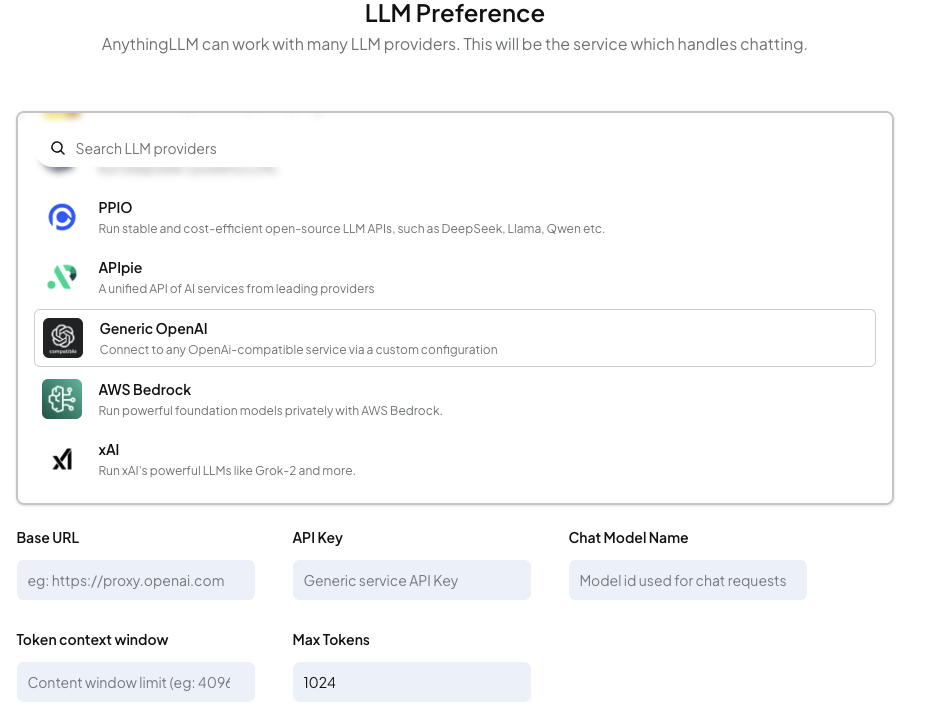

# Guide to Deploying AI Models on Red Hat OpenShift AI (RHOAI)

## Prerequisites 

A cluster that has been properly configured for model serving. If cluster is not yet properly configured follow the [Guide to Configuring RHOAI for Model Deployment](https://github.com/IsaiahStapleton/rhoai-config-guide)

## Purpose

The purpose for this guide is to offer the simplest steps for deploying an AI model on RHOAI. This guide will specifically be covering deploying the ***Granite Model*** using the ***vLLM ServingRuntime for KServe*** using a ***NVIDIA A100 GPU***. In addition to deploying the model, this guide will cover setting up a simple observability stack so that you can collect and visualize metrics related to AI model performance and GPU information.

## 1. Deploying S3 Storage using Minio 

### 1.1 What is Minio?

[Minio](https://min.io/) is a high-performance, S3 compatible **object store**. It can be deployed on a wide variety of platforms, and it comes in multiple [flavors](https://min.io/pricing).

### 1.2 Deploying Minio in Project Namespace

1. Within your namespace in the OpenShift console, click on the + ("Import YAML") button:


2. Apply the minio setup
- By default, the size of the storage is 50 GB. (see line 11). Change it if you need to, however it is not necessary to change it for this guide.
- If you want to, edit lines 21-22 to change the default user/password.

```
oc apply -f minio-setup.yaml
```


3. Give it a minute, nd there should now be a running minio pod:


4. As well as two minio routes:
- The -api route is for programmatic access to Minio
- The -ui route is for browser-based access to Minio


## 2. Downloading Model 

Navigate to https://huggingface.co/ and find the model you would like to deploy. For this guide I am going to be downloading the granite-3.0-8b-instruct model (https://huggingface.co/ibm-granite/granite-3.0-8b-instruct/tree/main).

First you need to generate an access token:
1. Navigate to settings -> access tokens
2. Select create new token
3. For token type, select Read and then give it a name
4. Copy the token

Now that you have a token, you can download the model.

```
git clone https://<user_name>:<token>@huggingface.co/<repo_path>
```

For me this looks like

```
git clone https://IsaiahS1:<token>@huggingface.co/ibm-granite/granite-3.0-8b-instruct
```


## 3. Uploading the Model to the S3 Minio Storage

1. Assuming you followed the steps above to deploy minio storage, navigate to the minio UI, found in Networking -> routes within the openshift console.


2. Login with the credentials you specified in the minio deployment

3. Create a bucket, give it a name such as “Models”, select create bucket


4. Select your bucket from the object browser 


5. From within the bucket, select upload -> upload folder, and select the folder where the model was downloaded from huggingface. Wait for the upload to finish, this will take a while.


## 4. Deploying Model on Red Hat OpenShift AI

### 4.1 Create S3 Storage Data Connection

1. Within your data science project, navigate to connections and select create connection


2. Fill in the following values:
- Connection name: name of your data connection
- Access key: username of minio deployment
- Secret key: password for minio deployment
- Endpoint: endpoint of the minio deployment 
- Bucket: name of the minio bucket you created


### 4.2. Deploy your Model!

Navigate to Models within your Data Science Project and select single-model serving:

***Note that once you select single or multi model serving, you are unable to change it without going into the openshift console and changing the value of the `modelmesh-enabled` tag on the namespace, true means multi model serving is enabled, false means single model serving is enabled. You can remove the tag entirely from the namespace if you want the option to select between the UI like you were able to in this step***


After selecting single-models serving, select Deploy Model


2. Fill in the following values:
- ***Model deployment name***: Name of the deployed model
- ***Serving runtime***: vLLM ServingRuntime for KServe
- ***Model server size***: You can select whatever size you wish, for this guide I will keep the small size 
- ***Accelerator***: Select NVIDIA GPU
- ***Model route***: Select check box for "Make deployed models available through an external route" this will enable us to send requests to the model endpoint from outside the cluster
- ***Token authentication***: Select check box for "Require token authentication" this makes it so that sending requests to the model endpoint requires a token, which is important for security. You can leave the service account name as default-name
- ***Source model location***: Select the data connection that you set up in step 4.1. Then provide it the path to your model. If you're follow this guide, the path will be granite-3.0-8b-instruct. If you're unsure of the path you can go to the minio-ui, navigate to the models bucket you create, and see the name of the directory where the model is stored.




Once that is done, you are all set to hit Deploy! It will take some time for the model to be deployed.

### 4.3 Current Issues/Bugs (CURRENTLY REQUIRED STEP)

After deploying your model, after some time the pod for the model may terminate. You have to manually go into the console and spin it back up to 1. After this, the model should not terminate again and it the model pod should succesfully be created. This is a current bug within RHOAI that is caused by large models being deployed. We believe the issue may be caused because the model is of a size that it takes a while to get it in place on the node or into the cluster that it isn't given a proper enough amount of breathing room to actually allow it to start up. This bug is currently in the backlog of things to fix. So for now with bigger models like granite, you will have to manually spin the pod back up.


After some minutes you can see my pod was terminated the deployment scaled to 0. I will just manually scale it back to 1 in the UI, or I can run the following command from the cli:

```
oc scale deployment/[deployment_name] --replicas=1 -n [namespace] --as system:admin
```

For me this looks like

```
oc scale deployment/demo-granite-predictor-00001-deployment --replicas=1 -n sandbox --as system:admin
```

After this it will take some time for the model pod to spin back up.

### 4.4 Query Model Endpoint

Once your model pod is in a running state, you can try querying it in order to test if the endpoint is reachable and the model is returning correctly

1. Get the URL for the model endpoint, you can get this by selecting internal and external endpoint details from the RHOAI UI within the models tab in your Data Science Project:


2. Get the Authorization Token for your model by selecting the dropdown to the left of your model name. Your Authorization Token is at the bottom under "token authentication" -> "token secret", you can just copy the token directly from the UI



3. Now that you have the URL and Authorization Token, you can try querying the model endpoint. We will try multiple queries.

#### /v1/models
Let's start with the simplest query, the /v1/models endpoint. This endpoint just returns information about the models being served, I use it to simply see if the model can accept a request and return with some information:

```
curl -k -X GET https://url/v1/models \ -H "Authorization: Bearer YOUR_BEARER_TOKEN"
```

Running this command should return an output similar to the below output

>{"object":"list","data":[{"id":"demo-granite","object":"model","created":1743010793,"owned_by":"vllm","root":"/mnt/models","parent":null,"max_model_len":4096,"permission":[{"id":"modelperm-09f199065a2846ec8bbfabea78f72349","object":"model_permission","created":1743010793,"allow_create_engine":false,"allow_sampling":true,"allow_logprobs":true,"allow_search_indices":false,"allow_view":true,"allow_fine_tuning":false,"organization":"*","group":null,"is_blocking":false}]}]}

#### v1/completions

Now that we know that works, let's test whether the /v1/completions endpoint works. This endpoint takes a text prompt and returns a completed text response. 

`curl -k -X POST https://url/v1/completions \
    -H "Content-Type: application/json" -H "Authorization: Bearer YOUR_BEARER_TOKEN" \
    -d '{
        "model": "demo-granite",
        "prompt": "San Francisco is a",
        "max_tokens": 7,
        "temperature": 0.7
    }'
`

Running this command should return an output similar to the following:

> {"id":"cmpl-40be2aa235c94f38a3b6161c6b93b59c","object":"text_completion","created":1743011184,"model":"demo-granite","choices":[{"index":0,"text":" city known for its diverse population","logprobs":null,"finish_reason":"length","stop_reason":null,"prompt_logprobs":null}],"usage":{"prompt_tokens":4,"total_tokens":11,"completion_tokens":7}}

You can see within "text" the completed response "San Francisco is a... city known for its diverse population"

You can change the ***temperature*** of the query. The temperature essentially controls the "randomness" of the model's response. The lower the temperature the more deterministic the reponse, the higher the temperature the more random/unpredictible the response. So if you set the temperature to 0, it would always return the same output since there would be no randomness. 

### 4.5 Wrapping Up

Congratulations! You have now successfully deployed the Granite Model on Red Hat Openshift AI using the vLLM ServingRuntime for KServe.

## 5. Setting up Observability Stack & Collecting Metrics

### 5.1 Prometheus 

#### 5.1.1 Configuring Prometheus - [Enable monitoring for user-defined projects](https://docs.redhat.com/en/documentation/openshift_container_platform/4.8/html/monitoring/enabling-monitoring-for-user-defined-projects#enabling-monitoring-for-user-defined-projects_enabling-monitoring-for-user-defined-projects) 

Prometheus is installed by default with OpenShift. However, the default monitoring stack only collects metrics related to core OpenShift platform components. Therefore we need to enable User Workload Monitoring in order to collect metrics from the model we have deployed. 

In order to enable monitoring for user-defined projects, we need to set `enableUserWorkload: true` in the cluster monitoring ConfigMap object. You can do this by applying the following yaml:

```
oc apply -f obs/cluster-monitoring-config.yaml
```

#### 5.1.2 Add vLLM metrics to user-workload (uwl) metrics allowlist

Now that we have enabled user-workload monitoring, we just need to add vLLM to the list of metrics we want to Prometheus to gather. We can do this be adding `vllm:.*` to the `uwl_metrics_list.yaml` in the project namespace. Before applying the yaml, make sure to change the value of namespace to the namespace that your model has been deployed in. Once you've changed the namespace value, update the `uwl_metrics_list.yaml` to add vLLM metrics:

```
oc apply -f obs/metrics_allowlist.yaml
```

### 5.2 Grafana

#### 5.2.1 [Install & Setup Grafana](https://grafana.com/docs/grafana/latest/setup-grafana/installation/kubernetes/)

1. Create Grafana namespace

```
oc create namespace grafana
```

2. Deploy grafana PVC, Service, and Deployment

```
oc apply -f obs/grafana-setup.yaml
```

3. Apply route to expose Grafana UI externally

```
oc apply -f obs/expose-grafana.yaml
```

4. Get the Grafana route URL:

```
oc get route grafana -n grafana -o jsonpath='https://{.spec.host}{"\n"}'
```


#### 5.2.2 Adding Data Source to Grafana

1. Create Grafana Secret Token

This is used so that Grafana can access the Prometheus Data Source.


```
oc apply -f obs/grafana-prometheus-token.yaml
```

Get the token by running the following command:

```
oc get secret grafana-prometheus-token \
  -n openshift-monitoring \
  -o jsonpath='{.data.token}' | base64 -d && echo
```

2. Add Data Source in Grafana UI

Navigate to data sources -> add data source




Select Prometheus as the data source, then fill in the following values:
- ***Prometheus Server URL***: https://thanos-querier.openshift-monitoring.svc.cluster.local:9091
- ***Skip TLS certificate Validation***: Check this box 
- ***HTTP headers***:
    - Header: Authorization
    - Value: Bearer [Token created in step 5.5]

Once the above is filled out, hit save and test at the bottom. You should then see the following:


3. Verify vLLM and DCGM Metrics can be read from Data Source

We want to make sure Grafana is actually getting the vLLM and DCGM metrics from the Data Source.

Go to explore->metrics explorer and then for the metric value type vllm, verify that you can see the diffeent vllm metrics. Then type DCGM, and verify you can see the different DCGM metrics.




### 5.3 Importing vLLM Dashboard

The vLLM dashboard that is used by Emerging Tech and Red Hat Research can be found here: https://github.com/redhat-et/ai-observability/blob/main/vllm-dashboards/vllm-grafana-openshift.json. This dashboard is based on the upstream vLLM dashboard. 

Go to Dashboards -> Create Dashboard


Select Import a dashboard. Then either upload the [vLLM dashboard yaml](https://github.com/redhat-et/ai-observability/blob/main/vllm-dashboards/vllm-grafana-openshift.json) or just copy and paste the yaml into the box provided.


Then hit load, then Import.


### 5.4 Importing DCGM Dashboard

The DCGM Grafana Dashboard can be found here: https://grafana.com/grafana/dashboards/12239-nvidia-dcgm-exporter-dashboard/. 

Go back to dashboards in Grafana UI and select new->import. Copy the following dashboard ID: `12239`. Paste that dashboard ID on Import Dashboard page. Then hit load.


Select prometheus data source then select Import.


Now you should have succesfully imported the NVIDIA DCGM Exporter Dashboard, useful for GPU Monitoring.


