# Workshop Guide To Deploy AI Models on Red Hat OpenShift AI (RHOAI)

## Overview
1.  Walkthrough of the provisioned environment, Red Hat Openshift AI Dashboard

1. Connect to a pre-packaged LLM modelcar container

1. Deploy a generative AI model with serving endpoint

1. Create and use a custom workbench with the deployed inference server

1. QnA with Retrieval Augmented Generation

1. Monitor the deployed model

### Prerequisites for environment 

An OpenShift cluster that have OpenShift AI with Nvidia GPU. 
- For Red Hatters, provision a demo environment from the demo catalog, ie. RHOAI on OCP on AWS with NVIDIA GPUs. 
- For attendees, this is already setup for you.

## Purpose

The purpose for this guide is to offer the simplest steps for deploying a **privately hosted AI model** on Red Hat Openshift AI. This guide will be covering deploying a Red Hat certified ***Qwen3 Model*** using the ***vLLM ServingRuntime for KServe*** on ***NVIDIA GPU***. In addition to deploying the model, we will showcase a simple observability stack so that you can collect and visualize metrics related to AI model performance and GPU information.

## 3. Deploying Model on Red Hat OpenShift AI

### 3.1 Create a workspace
Login to your environment. If you're in a workshop, [follow the link to the portal from your host](). 

1. Go to Data Science Projects and create a project. This will be your workspace where you manage workbenches, models, pipelines, storage connections.

    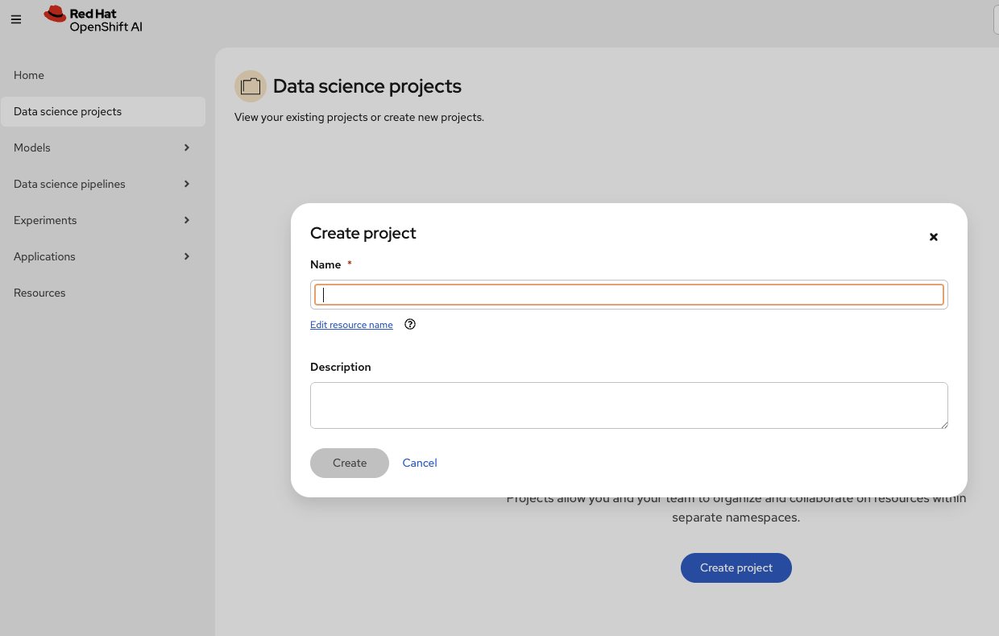

### Use a pre-built LLM container
Using a pre-built modelcar container with LLM makes deployment faster. This is the easiest way to get a LLM model running on Red Hat OpenShift AI. Since the model is pre-packaged, it does not need to download from HuggingFace, you can deploy this in an air-gapped environment!

1. Navigate to https://quay.io/repository/redhat-ai-services/modelcar-catalog and explore the available models.

1. Select a containerized model you want to use. In this example, we will use qwen3-4b.

1. Click the download/save button to reveal the tags, select any of the tag to reveal the URI.


    
1. Copy the URL from quay.io onwards.

1. Next, deploy the model by navigating to the Models tab in your workspace on Red Hat Openshift AI. Go to the Models tab within your Data Science Project and select single-model serving:


<!-- ***Note that once you select single or multi model serving, you are unable to change it without going into the openshift console and changing the value of the `modelmesh-enabled` tag on the namespace, true means multi model serving is enabled, false means single model serving is enabled. You can remove the tag entirely from the namespace if you want the option to select between the UI like you were able to in this step*** -->
  
6. Fill in a name, ensure to choose nvidia gpu serving runtime and deployment mode to **Standard**.

1. Remember to check the box to secure the LLM model endpoint that you are about to deploy.

1. Select connection type *URI - v1* and give it a name. A good practice is to name it the model you are about to deploy.
1. Next, append the URI with oci://


    ```
    oci://quay.io/redhat-ai-services/modelcar-catalog:qwen3-4b
    ```

    >Note: If you face resource problems, try select a smaller model. For example qwen2.5-0.5b
        ```
        oci://quay.io/redhat-ai-services/modelcar-catalog:qwen2.5-0.5b-instruct
        ```

1. Your deployment will look something like this.

- ***Model deployment name***: Name of the deployed model
- ***Serving runtime***: vLLM NVIDIA GPU ServingRuntime for KServe
- ***Model server size***: You can select whatever size you wish, for this guide I will keep the small size 
- ***Accelerator***: Select NVIDIA GPU
- ***Model route***: Select check box for "Make deployed models available through an external route" this will enable us to send requests to the model endpoint from outside the cluster
- ***Token authentication***: Select check box for "Require token authentication" this makes it so that sending requests to the model endpoint requires a token, which is important for security. You can leave the service account name as default-name.

11. Wait for the model to finish deploy and the status turns green. 
    > Note: It may take up to a few minutes depending on model size.

    
12. In production deployment, you might want to adjust the vllm parameter args to fit your use case, for example increase context length or apply certain quantization. Every use case is different and there is no silver bullet for a config that fits all. 

### 4. Query Model Inference Endpoint

Once your model pod is in a running state, you can try querying it in order to test if the endpoint is reachable and the model is returning correctly. The status will have a green tick.

1. Get the URL for the model endpoint, you can get this by selecting internal and external endpoint details from the RHOAI UI within the models tab in your Data Science Project:

    

2. Get the Authorization Token for your model by selecting the dropdown to the left of your model name. Your Authorization Token is at the bottom under "token authentication" -> "token secret", you can just copy the token directly from the UI

    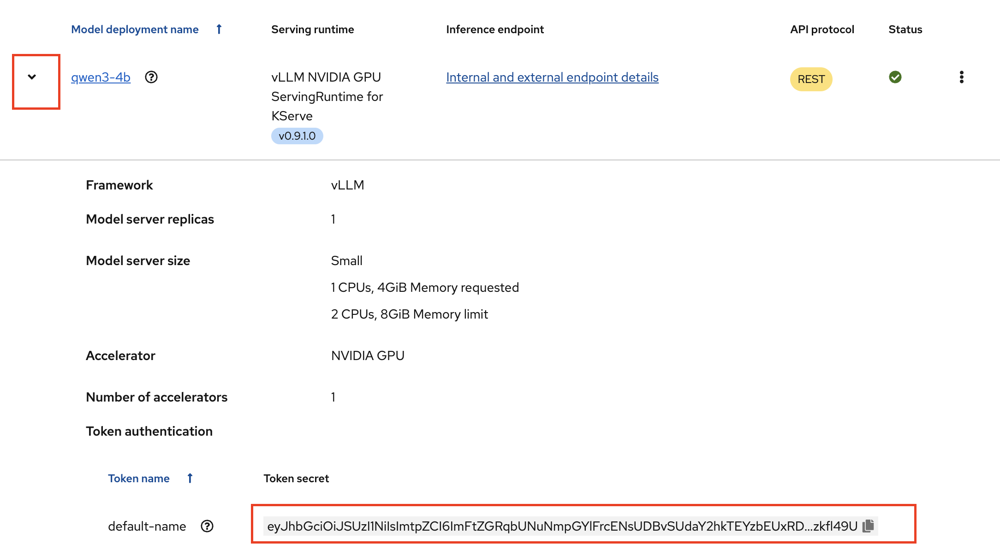

3. Now that you have the URL and Authorization Token, you can try querying the model endpoint. We will try multiple queries.

#### /v1/models
Let's start with the simplest query, the /v1/models endpoint. This endpoint just returns information about the models being served, we can use it to simply see if the model can accept a request and return with some information. Open up a command window or terminal of your chosing on your computer:

> Note: Remember to change the url and bearer token. the url must end with v1/models.

```shell
curl -k -X GET https://url/v1/models -H "Authorization: Bearer YOUR_BEARER_TOKEN"
```

Running this command should return an output similar to the below output

>{"object":"list","data":[{"id":"qwen3-4b","object":"model","created":1743010793,"owned_by":"vllm","root":"/mnt/models","parent":null,"max_model_len":4096,"permission":[{"id":"modelperm-09f199065a2846ec8bbfabea78f72349","object":"model_permission","created":1743010793,"allow_create_engine":false,"allow_sampling":true,"allow_logprobs":true,"allow_search_indices":false,"allow_view":true,"allow_fine_tuning":false,"organization":"*","group":null,"is_blocking":false}]}]}

#### v1/completions

Now that we know that works, let's test whether the /v1/completions endpoint works. This endpoint takes a text prompt and returns a completed text response. 

```shell
curl -k -X POST https://url/v1/completions \
    -H "Content-Type: application/json" -H "Authorization: Bearer YOUR_BEARER_TOKEN" \
    -d '{
        "model": "MODEL_NAME",
        "prompt": "Red Hat is",
        "max_tokens": 7,
        "temperature": 0.7
    }'
```

Running this command should return an output similar to the following:

> {"id":"cmpl-40be2aa235c94f38a3b6161c6b93b59c","object":"text_completion","created":1743011184,"model":"qwen3-4b","choices":[{"index":0,"text":" a company that provides software and services.","logprobs":null,"finish_reason":"length","stop_reason":null,"prompt_logprobs":null}],"usage":{"prompt_tokens":4,"total_tokens":11,"completion_tokens":7}}

You can see within "text" the completed response "Red Hat is a... a company that provides software and services."

You can change the ***temperature*** of the query. The temperature essentially controls the "randomness" of the model's response. The lower the temperature the more deterministic the response, the higher the temperature the more random/unpredictable the response. So if you set the temperature to 0, it would always return the same output since there would be no randomness. 

**Congratulations! You have now successfully deployed a LLM model on Red Hat Openshift AI using the vLLM ServingRuntime for KServe.**

## 5. Deploy A Custom Workbench To Interact With The LLM

### 5.1 AnythingLLM
AnythingLLM is a full-stack application that enables you to turn any document, resource, or piece of content into context that any LLM can use as a reference during chatting. This application allows you to pick and choose which LLM or Vector Database you want to use as well as supporting multi-user management and permissions.

#### 5.1.1 AnythingLLM in Red Hat Openshift AI
To get started quickly, we will use a custom workbench - a feature offered by Red Hat Openshift AI to quickly host compatible containerized applications as workbench easily. In your organization, you can BYO workbench as well!
  
  >**Step 1 may already have been setup by your admin. If you are participating in a workshop, skip this and continue on to **step 2**.**

  1. We will add an image by providing the details of the hosted container registry. Navigate to ```https://quay.io/rh-aiservices-bu/anythingllm-workbench:1.8.5``` Copy the URL and paste it into Settings > Workbench Images > image location.

      

  >**Step 2 : If you're a workshop participant, start here!**
  2. Create a new workbench, pick the name of the workbench you have given in the previous step. If you are participating in a workshop and your admin have already set up for you, choose "AnythingLLM".

      

      <!-- Remember to make your storage name unique to avoid name clash.
      
      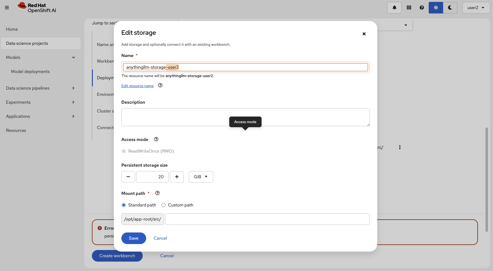 -->
    
  1. Choose a small size container and skip the accelerator. You do not need a GPU for the application, a GPU is already assigned to your LLM model.

     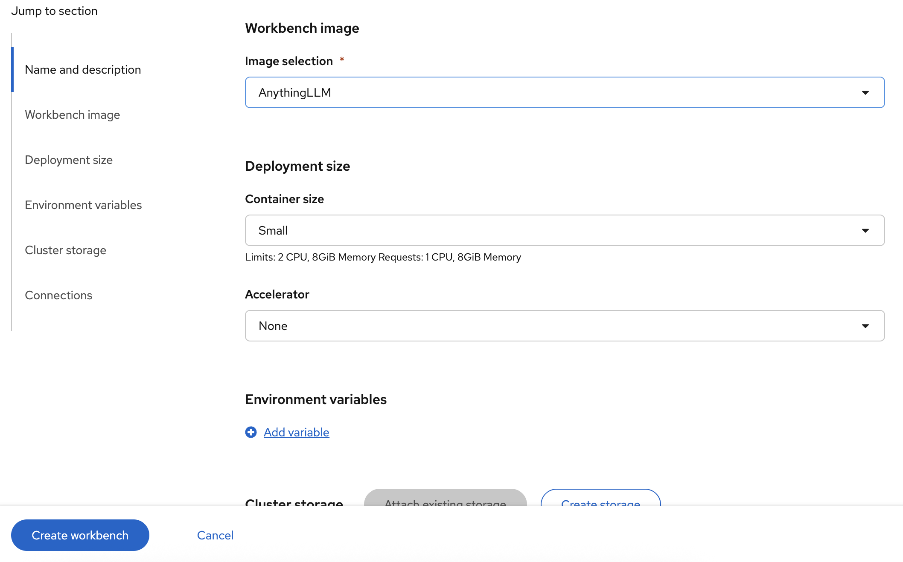

  1. Wait for the workbench to start. You should see a green status showing it is running. Click on the name to navigate to AnythingLLM UI.

      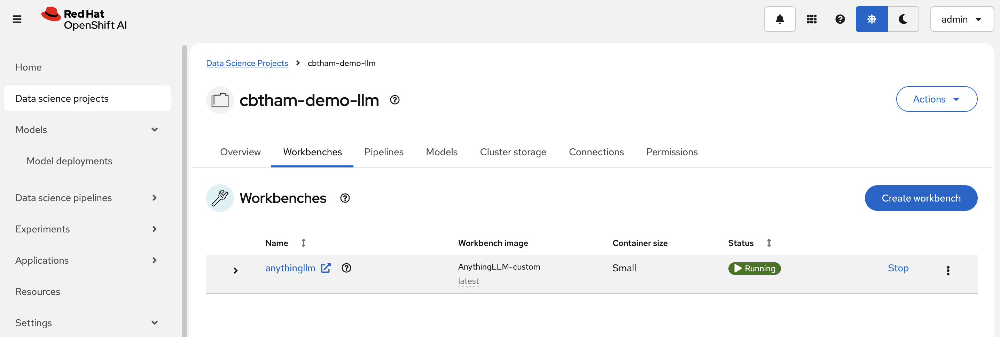
  1. Click on the Anythingllm hyperlink to go to the workbench application that you have just deployed! 

### 5.2 Connecting AnythingLLM To Our Privately Hosted Model
AnythingLLM is able to consume inference endpoints from multiple AI provider. In this exercise, we will configure it to connect to our privately hosted LLM inference endpoints set up in previous steps.

1. Select OpenAI Compatible API

    

1. Paste the baseURL from your deployed model(external endpoint) and append **/v1** on it. It will look like this example

    ```https://qwen3-4b.apps.cluster-q2cbm.q2cbm.sandbox1007.opentlc.com/v1```

    >**Note: Use your url. The above is an example.**

1. Paste the token copied from above steps as the API key. The token starts with ey....

    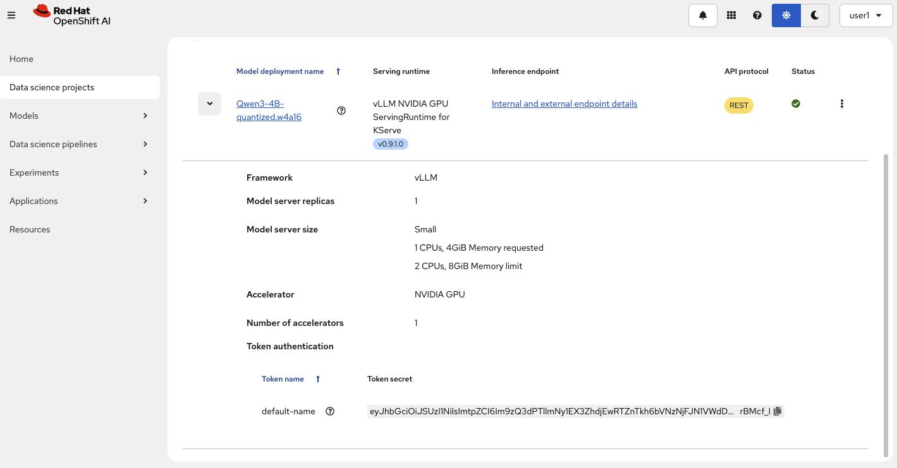

1. Use the name of the model you deployed. In this example, I use qwen3-4b as the name of the model. You may key in the name of your model that you want to use. You can refer the model name from the deployed model URL at Red Hat OpenShift AI models tab.

1. Set the context window and max token to 4096.

1. Choose use this for "Just me." and skip password since it is a demo in the next steps. You can skip through the settings that ask for database setup and survey. Give a name to your workspace. 

    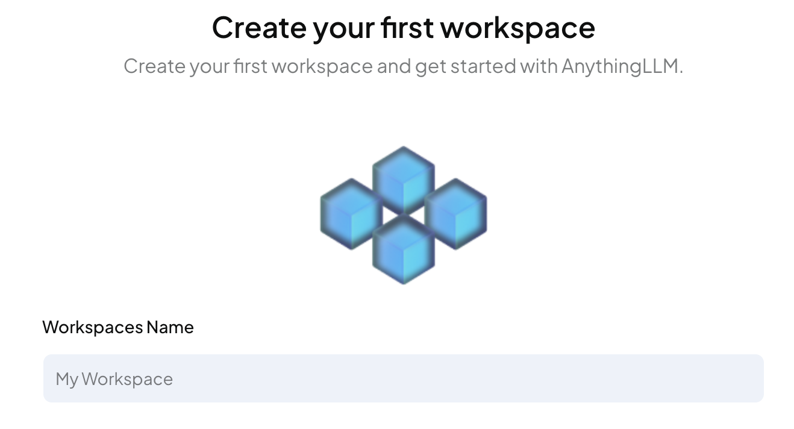

1. When you are done, you will see AnythingLLM main page.

    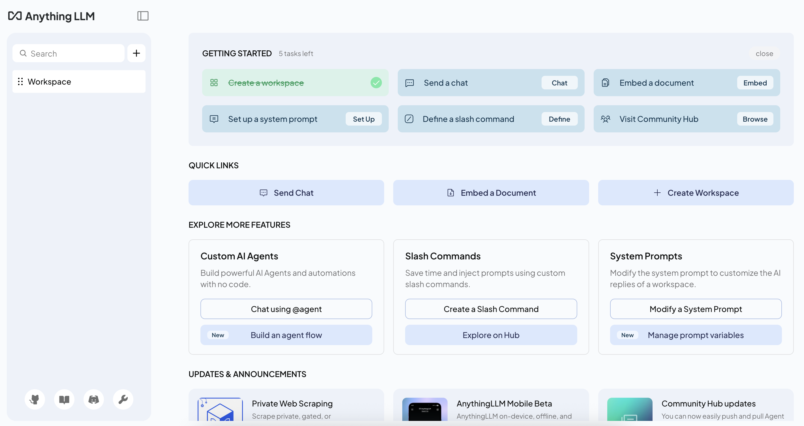

1. Navigate to workspace or select "send a chat" to start. If everything is set up properly, you will be greeted with a response from the LLM that you just deployed!

    

    **You are now an AI engineering expert!**

    In production there are more to it. Things like managing the LLM endpoint lifecycle, logs, versioning, automating CICD deployment and even giving a guardrail are extremely important. Red Hat Openshift AI is your one stop platform to implement all these.

### 5.3 Retrieval Augmented Generation with AnythingLLM 
RAG, or Retrieval-Augmented Generation, is an AI framework that combines the strengths of traditional information retrieval systems with generative large language models (LLMs). It allows LLMs to access and reference information outside their training data to provide more accurate, up-to-date, and relevant responses. Essentially, RAG enhances LLMs by enabling them to tap into external knowledge sources, like documents, databases, or even the internet, before generating text.

For the purpose of demonstration, we will use a local vector database - LanceDB.

LanceDB is deployed as part of AnythingLLM. You may explore the settings page of AnythingLLM to provide your own vector database.

### 5.4 Scraping Website For RAG
You may insert your own pdf, csv or any digestible format for RAG. In this guide, we will step up a notch to scrape website and use its data as RAG. We will use built-in scraper from AnythingLLM, after getting the data, it will chunk it and store in the vector database LanceDB for retrieval.

1. We first ask a question and capture the default response. We'll see the LLM gave us a generic response.
   > Ask: What is an AI tool from Intel?
   
   
   We can see the response is short and very generic.

#### Option 1 : Upload your own data (PDF)
2. Now lets implement RAG by attaching a pdf ([demo-rag.pdf](../rag-demo.pdf)). Click on the upload button beside your user workspace.
    
3. Upload the pdf rag-demo.pdf.
    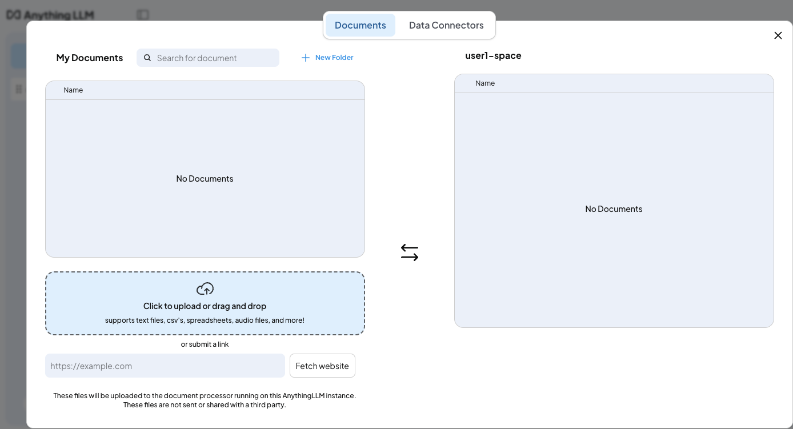
4. After that, move it to the workspace and click Save and Embed.
    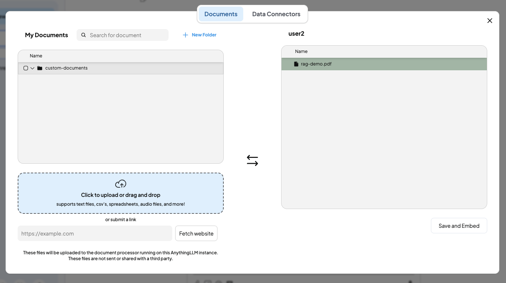
5. We can see the answer after RAG is more detailed with reference to the data we uploaded.
    
    >Note: You can verify this by expanding the show citation.

#### Option 2 : Scrapping a website

6. Now let's try another way to implement RAG by scraping a website. The website has a section which has a better answer to our previous question.
7. Instead of uploading a document, select Data Connector and click bulk link scraper.
    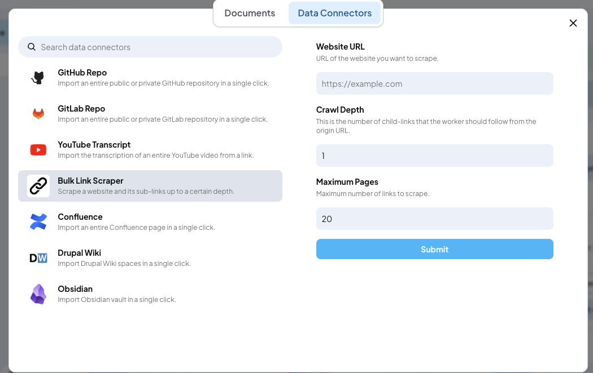
8. Input the link, set the depth to 1 and click Submit.
   > https://www.redhat.com/en/about/press-releases/red-hat-optimizes-red-hat-ai-speed-enterprise-ai-deployments-across-models-ai-accelerators-and-clouds
9. Web scraping will take some time especially with the depth set to a higher value. If you are an admin, you can navigate to the anythingllm pod and see the process of scraping, chunking and embedding.
10. Once this step is done, you will see the data available. Move it to the workspace, save and embed.
    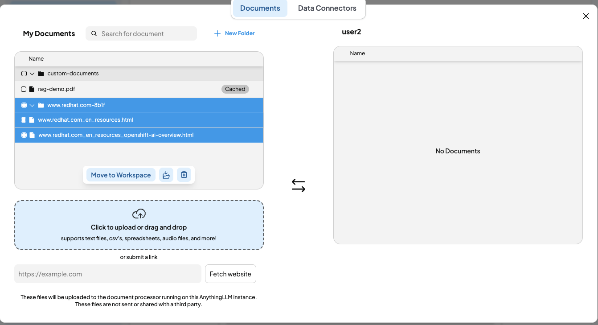
11. After that, ask the question ***What is Red Hat's AI vision?***
and you can see the answer is much more detailed and with reference to the scraped website compared to when you have not provide it a data source.

12. Behind the scenes, AnythingLLM scraped the website, chunked it and embedded it into the workspace. This view is only available as admin.
    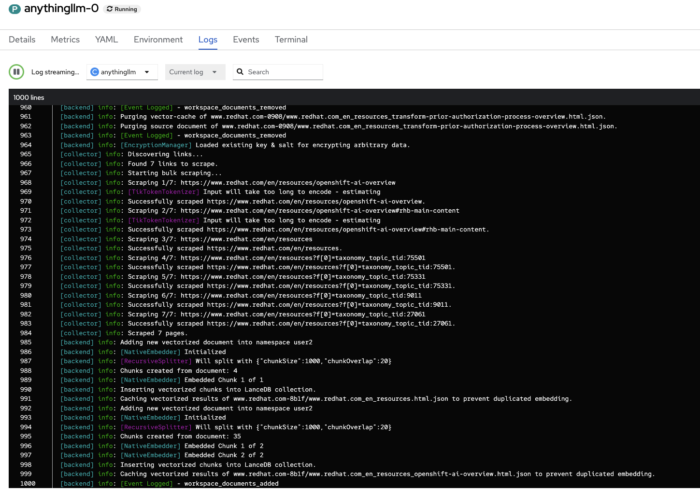

13. In your organization, you can extend this to scrape internal knowledge bases, git repository, configuration playbooks for exaple
## 6. Setting up Observability Stack & Collecting Metrics

The following section requires you run code in a Terminal. You can run this directly on Red Hat Openshift console or run this through your local terminal connected to the openshift cluster. When you are ready, git clone this repository.

```shell
git clone https://github.com/cbtham/rhoai-genai-workshop.git
```

### 6.1 Prometheus 

#### 6.1.1 Configuring Prometheus - [Enable monitoring for user-defined projects](https://docs.redhat.com/en/documentation/openshift_container_platform/4.8/html/monitoring/enabling-monitoring-for-user-defined-projects#enabling-monitoring-for-user-defined-projects_enabling-monitoring-for-user-defined-projects) 

Prometheus is installed by default with OpenShift. However, the default monitoring stack only collects metrics related to core OpenShift platform components. Therefore we need to enable User Workload Monitoring in order to collect metrics from the model we have deployed. 

In order to enable monitoring for user-defined projects, we need to set `enableUserWorkload: true` in the cluster monitoring ConfigMap object. You can do this by applying the following yaml:

```
oc apply -f obs/cluster-monitoring-config.yaml -n openshift-monitoring
```

#### 6.1.2 Add vLLM metrics to user-workload (uwl) metrics allowlist

Now that we have enabled user-workload monitoring, we just need to add vLLM to the list of metrics we want Prometheus to gather. We can do this by adding `vllm:.*` to the `metrics_allowlist.yaml` in the project namespace. Before applying the yaml, make sure to **CHANGE** the value of namespace to the namespace that your model has been deployed in. Once you've changed the namespace value, deploy with the following command.

```shell
oc apply -f obs/metrics_allowlist.yaml
```
> Note: If you face Error from server (NotFound): error when creating "obs/metrics_allowlist.yaml": namespaces "YOUR_PROJECT_NAMESPACE" not found, modify the metrics_allowlist.yaml to include reflect your project namespace.

### 6.2 Grafana

#### 6.2.1 [Install & Setup Grafana](https://grafana.com/docs/grafana/latest/setup-grafana/installation/kubernetes/)

1. Create Grafana namespace

```
oc create namespace grafana
```

2. Deploy grafana PVC, Service, and Deployment

```
oc apply -f obs/grafana-setup.yaml -n grafana
```

3. Apply route to expose Grafana UI externally

```
oc apply -f obs/expose-grafana.yaml -n grafana
```

4. Get the Grafana route URL:

```
oc get route grafana -n grafana -o jsonpath='https://{.spec.host}{"\n"}'
```


#### 6.2.2 Adding Data Source to Grafana

1. Create Grafana Secret Token

This is used so that Grafana can access the Prometheus Data Source.


```
oc apply -f obs/grafana-prometheus-token.yaml -n grafana --namespace=openshift-monitoring
```

Get the token by running the following command:

```
oc get secret grafana-prometheus-token \
  -n openshift-monitoring \
  -o jsonpath='{.data.token}' | base64 -d && echo
```

2. Add Data Source in Grafana UI

Navigate to data sources -> add data source


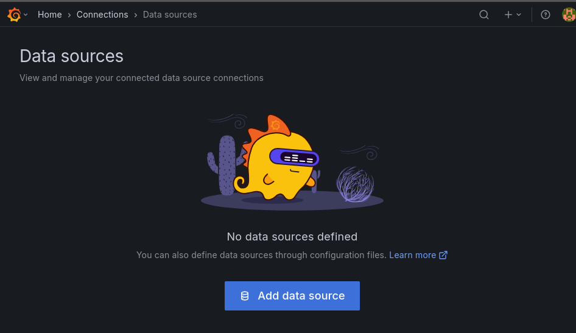

Select Prometheus as the data source, then fill in the following values:
- ***Prometheus Server URL***: https://thanos-querier.openshift-monitoring.svc.cluster.local:9091
- ***Skip TLS certificate Validation***: Check this box 
- ***HTTP headers***:
    - Header: Authorization
    - Value: Bearer [Token created in step 6.2.2]

  > Prometheus server url is the same for everyone
  
  > The Value should include "Bearer\<SPACE\>YOUR_TOKEN"

Once the above is filled out, hit save and test at the bottom. You should then see the following:


3. Verify vLLM and DCGM Metrics can be read from Data Source

We want to make sure Grafana is actually getting the vLLM and DCGM metrics from the Data Source.

Go to explore->metrics explorer and then for the metric value type vllm, verify that you can see the different vllm metrics. Then type DCGM, and verify you can see the different DCGM metrics.


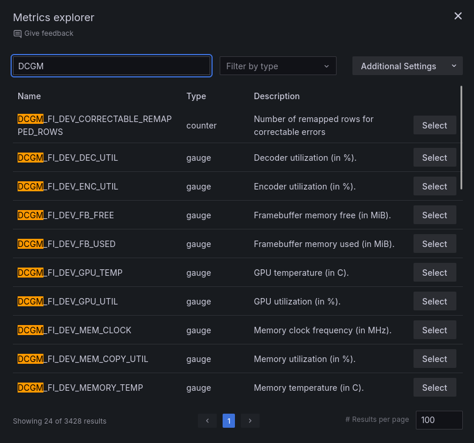


### 6.3 Importing vLLM Dashboard

The vLLM dashboard that is used by Emerging Tech and Red Hat Research can be found here: https://github.com/redhat-et/ai-observability/blob/main/vllm-dashboards/vllm-grafana-openshift.json. This dashboard is based on the upstream vLLM dashboard. 

Go to Dashboards -> Create Dashboard


Select Import a dashboard. Then either upload the [vLLM dashboard yaml](https://github.com/redhat-et/ai-observability/blob/main/vllm-dashboards/vllm-grafana-openshift.json) or just copy and paste the yaml into the box provided.

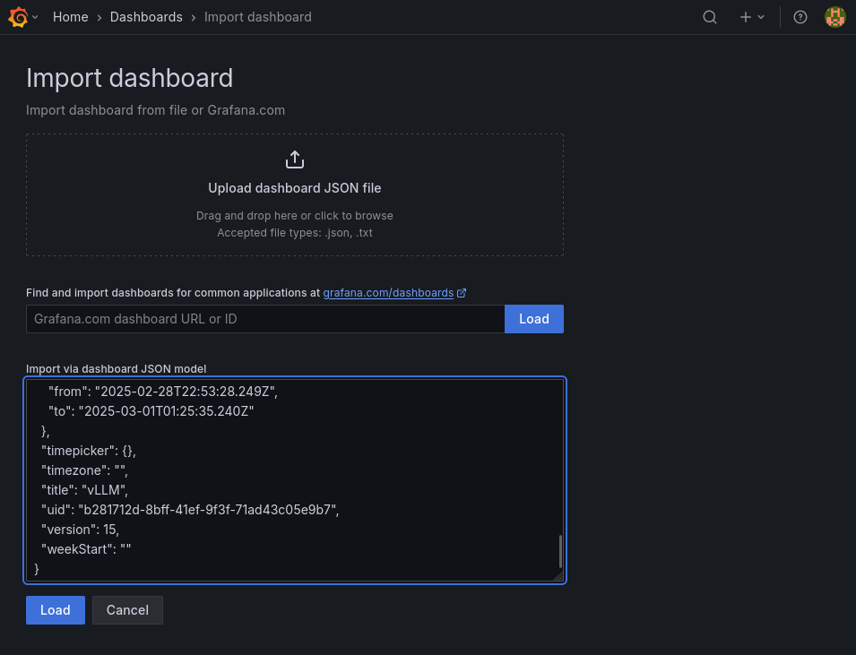

Then hit load, then Import.


### 6.4 Importing DCGM Dashboard

The DCGM Grafana Dashboard can be found here: https://grafana.com/grafana/dashboards/12239-nvidia-dcgm-exporter-dashboard/. 

Go back to dashboards in Grafana UI and select new->import. Copy the following dashboard ID: `12239`. Paste that dashboard ID on Import Dashboard page. Then hit load.

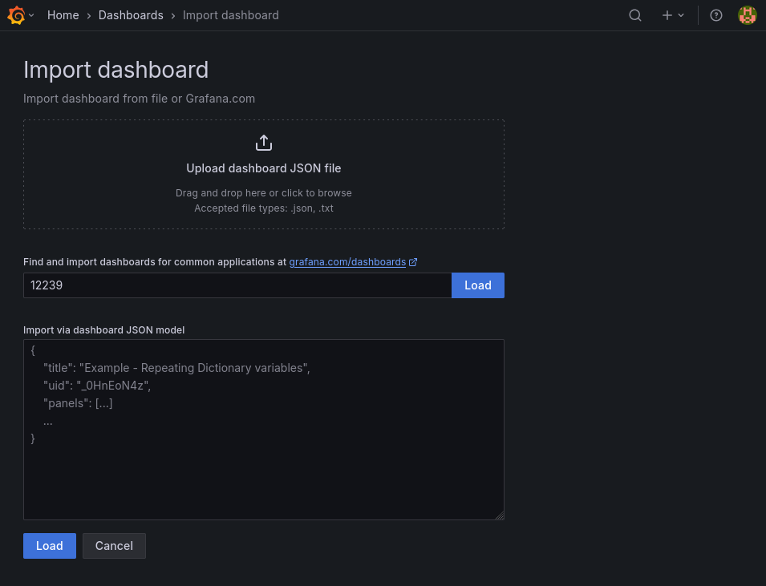

Select prometheus data source then select Import.


Now you should have successfully imported the NVIDIA DCGM Exporter Dashboard, useful for GPU Monitoring.


## Knowledge Base
### Model pod automatically terminated (Workaround)

Post deploying your model, after some time the pod for the model may terminate. You have to manually go into the console and spin it back up to 1. After this, the model should not terminate again and the model pod should successfully be created. This is a current bug that is caused by large models being deployed. We believe the issue may be caused because the model is of a size that it takes a while to get it in place on the node or into the cluster that it isn't given a proper enough amount of breathing room to actually allow it to start up. This bug is currently in the backlog of things to fix. So for now with bigger models like granite, you will have to manually spin the pod back up.


After some minutes you can see my pod was terminated the deployment scaled to 0. I will just manually scale it back to 1 in the UI, or I can run the following command from the cli:

```
oc scale deployment/[deployment_name] --replicas=1 -n [namespace] --as system:admin
```

For me this looks like

```
oc scale deployment/demo-granite-predictor-00001-deployment --replicas=1 -n sandbox --as system:admin
```

After this it will take some time for the model pod to spin back up.

#
